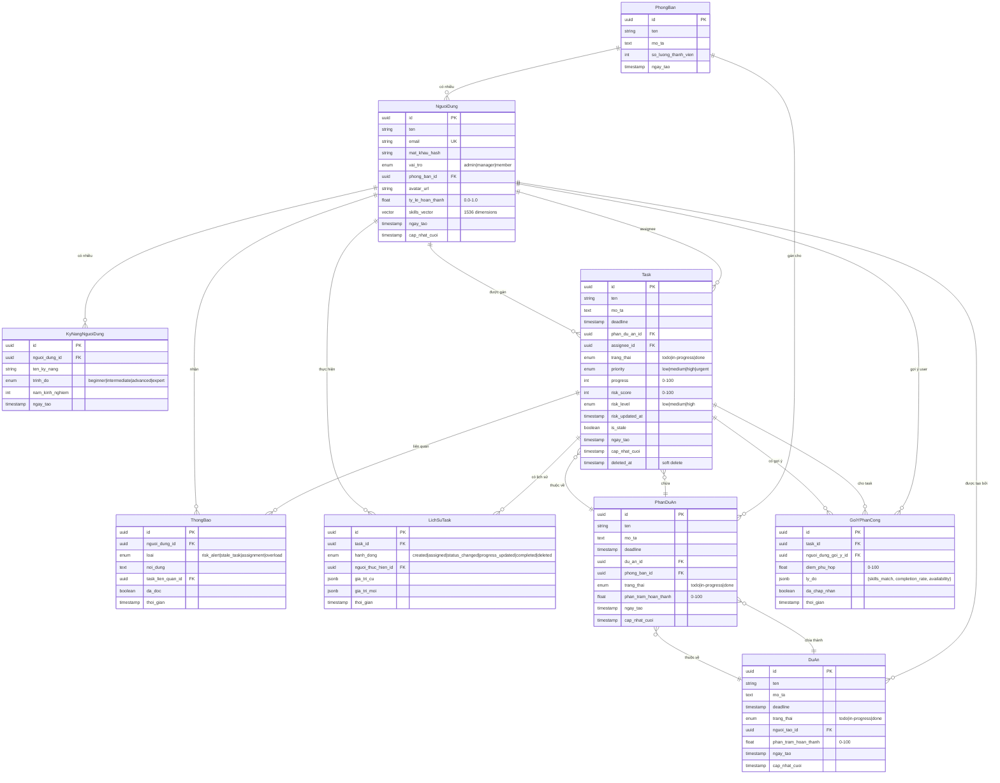

# Data Model: Hệ Thống Quản Lý Công Việc Thông Minh

**Feature**: 1-smart-task-management  
**Created**: 2026-01-16  
**Database**: PostgreSQL 16 + pgvector extension  
**ORM**: Prisma 5.x

## Entity Relationship Diagram



## Prisma Schema

```prisma
// prisma/schema.prisma

generator client {
  provider = "prisma-client-js"
  previewFeatures = ["postgresqlExtensions"]
}

datasource db {
  provider = "postgresql"
  url      = env("DATABASE_URL")
  extensions = [pgvector(map: "vector")]
}

model PhongBan {
  id                     String       @id @default(uuid())
  ten                    String       @db.VarChar(200)
  moTa                   String?      @db.Text
  soLuongThanhVien       Int          @default(0)
  ngayTao                DateTime     @default(now())
  
  // Relations
  nguoiDung              NguoiDung[]
  phanDuAn               PhanDuAn[]
  
  @@map("phong_ban")
}

model NguoiDung {
  id                     String                @id @default(uuid())
  ten                    String                @db.VarChar(200)
  email                  String                @unique @db.VarChar(255)
  matKhauHash            String                @db.VarChar(255)
  vaiTro                 VaiTro                @default(MEMBER)
  phongBanId             String?
  avatarUrl              String?               @db.VarChar(500)
  tyLeHoanThanh          Float                 @default(0.0) @db.Real
  skillsVector           Unsupported("vector(1536)")?
  ngayTao                DateTime              @default(now())
  capNhatCuoi            DateTime              @updatedAt
  
  // Relations
  phongBan               PhongBan?             @relation(fields: [phongBanId], references: [id])
  kyNang                 KyNangNguoiDung[]
  tasksGan               Task[]                @relation("TaskAssignee")
  duAnTao                DuAn[]                @relation("ProjectCreator")
  lichSuTask             LichSuTask[]
  goiYNhan               GoiYPhanCong[]
  thongBao               ThongBao[]
  
  @@index([phongBanId])
  @@index([email])
  @@map("nguoi_dung")
}

model KyNangNguoiDung {
  id                     String       @id @default(uuid())
  nguoiDungId            String
  tenKyNang              String       @db.VarChar(100)
  trinhDo                TrinhDo
  namKinhNghiem          Int?
  ngayTao                DateTime     @default(now())
  
  // Relations
  nguoiDung              NguoiDung    @relation(fields: [nguoiDungId], references: [id], onDelete: Cascade)
  
  @@unique([nguoiDungId, tenKyNang])
  @@index([nguoiDungId])
  @@map("ky_nang_nguoi_dung")
}

model DuAn {
  id                     String       @id @default(uuid())
  ten                    String       @db.VarChar(300)
  moTa                   String?      @db.Text
  deadline               DateTime
  trangThai              TrangThai    @default(TODO)
  nguoiTaoId             String
  phanTramHoanThanh      Float        @default(0) @db.Real
  ngayTao                DateTime     @default(now())
  capNhatCuoi            DateTime     @updatedAt
  
  // Relations
  nguoiTao               NguoiDung    @relation("ProjectCreator", fields: [nguoiTaoId], references: [id])
  phanDuAn               PhanDuAn[]
  
  @@index([nguoiTaoId])
  @@index([trangThai])
  @@index([deadline])
  @@map("du_an")
}

model PhanDuAn {
  id                     String       @id @default(uuid())
  ten                    String       @db.VarChar(300)
  moTa                   String?      @db.Text
  deadline               DateTime
  duAnId                 String
  phongBanId             String
  trangThai              TrangThai    @default(TODO)
  phanTramHoanThanh      Float        @default(0) @db.Real
  ngayTao                DateTime     @default(now())
  capNhatCuoi            DateTime     @updatedAt
  
  // Relations
  duAn                   DuAn         @relation(fields: [duAnId], references: [id], onDelete: Cascade)
  phongBan               PhongBan     @relation(fields: [phongBanId], references: [id])
  tasks                  Task[]
  
  @@index([duAnId])
  @@index([phongBanId])
  @@index([trangThai])
  @@map("phan_du_an")
}

model Task {
  id                     String                @id @default(uuid())
  ten                    String                @db.VarChar(300)
  moTa                   String?               @db.Text
  deadline               DateTime
  phanDuAnId             String
  assigneeId             String?
  trangThai              TrangThai             @default(TODO)
  priority               Priority              @default(MEDIUM)
  progress               Int                   @default(0)
  riskScore              Int?
  riskLevel              RiskLevel?
  riskUpdatedAt          DateTime?
  isStale                Boolean               @default(false)
  ngayTao                DateTime              @default(now())
  capNhatCuoi            DateTime              @updatedAt
  deletedAt              DateTime?
  
  // Relations
  phanDuAn               PhanDuAn              @relation(fields: [phanDuAnId], references: [id], onDelete: Cascade)
  assignee               NguoiDung?            @relation("TaskAssignee", fields: [assigneeId], references: [id])
  lichSu                 LichSuTask[]
  goiY                   GoiYPhanCong[]
  thongBao               ThongBao[]
  
  @@index([phanDuAnId])
  @@index([assigneeId])
  @@index([trangThai])
  @@index([deadline])
  @@index([riskLevel])
  @@index([deletedAt])
  @@map("task")
}

model LichSuTask {
  id                     String       @id @default(uuid())
  taskId                 String
  hanhDong               HanhDong
  nguoiThucHienId        String
  giaTriCu               Json?
  giaTriMoi              Json?
  thoiGian               DateTime     @default(now())
  
  // Relations
  task                   Task         @relation(fields: [taskId], references: [id], onDelete: Cascade)
  nguoiThucHien          NguoiDung    @relation(fields: [nguoiThucHienId], references: [id])
  
  @@index([taskId])
  @@index([nguoiThucHienId])
  @@index([thoiGian])
  @@map("lich_su_task")
}

model GoiYPhanCong {
  id                     String       @id @default(uuid())
  taskId                 String
  nguoiDungGoiYId        String
  diemPhuHop             Float        @db.Real
  lyDo                   Json
  daChapNhan             Boolean?
  thoiGian               DateTime     @default(now())
  
  // Relations
  task                   Task         @relation(fields: [taskId], references: [id], onDelete: Cascade)
  nguoiDungGoiY          NguoiDung    @relation(fields: [nguoiDungGoiYId], references: [id])
  
  @@index([taskId])
  @@index([nguoiDungGoiYId])
  @@map("goi_y_phan_cong")
}

model ThongBao {
  id                     String       @id @default(uuid())
  nguoiDungId            String
  loai                   LoaiThongBao
  noiDung                String       @db.Text
  taskLienQuanId         String?
  daDoc                  Boolean      @default(false)
  thoiGian               DateTime     @default(now())
  
  // Relations
  nguoiDung              NguoiDung    @relation(fields: [nguoiDungId], references: [id], onDelete: Cascade)
  taskLienQuan           Task?        @relation(fields: [taskLienQuanId], references: [id], onDelete: SetNull)
  
  @@index([nguoiDungId])
  @@index([daDoc])
  @@index([thoiGian])
  @@map("thong_bao")
}

// Enums

enum VaiTro {
  ADMIN
  MANAGER
  MEMBER
  
  @@map("vai_tro")
}

enum TrinhDo {
  BEGINNER
  INTERMEDIATE
  ADVANCED
  EXPERT
  
  @@map("trinh_do")
}

enum TrangThai {
  TODO
  IN_PROGRESS
  DONE
  
  @@map("trang_thai")
}

enum Priority {
  LOW
  MEDIUM
  HIGH
  URGENT
  
  @@map("priority")
}

enum RiskLevel {
  LOW
  MEDIUM
  HIGH
  
  @@map("risk_level")
}

enum HanhDong {
  CREATED
  ASSIGNED
  STATUS_CHANGED
  PROGRESS_UPDATED
  COMPLETED
  DELETED
  
  @@map("hanh_dong")
}

enum LoaiThongBao {
  RISK_ALERT
  STALE_TASK
  ASSIGNMENT
  OVERLOAD
  
  @@map("loai_thong_bao")
}
```

## Database Setup SQL

```sql
-- Enable pgvector extension (chạy trước khi migrate)
CREATE EXTENSION IF NOT EXISTS vector;

-- Create indexes sau khi migrate
-- Prisma tự động tạo indexes từ @@index, nhưng có thể tạo thêm:

-- Vector similarity search index (HNSW algorithm)
CREATE INDEX idx_nguoi_dung_skills_vector ON nguoi_dung 
USING hnsw (skills_vector vector_cosine_ops);

-- Composite indexes cho common queries
CREATE INDEX idx_task_assignee_status ON task (assignee_id, trang_thai);
CREATE INDEX idx_task_phan_du_an_status ON task (phan_du_an_id, trang_thai);

-- Partial index cho active tasks only (exclude soft-deleted)
CREATE INDEX idx_task_active ON task (id, trang_thai) WHERE deleted_at IS NULL;
```

## Entity Descriptions

### PhongBan (Department)

**Purpose**: Đơn vị tổ chức, nhóm users theo bộ phận

**Key Fields**:
- `soLuongThanhVien`: Tính toán từ COUNT(nguoi_dung), có thể cache

**Business Rules**:
- Một user chỉ thuộc một phòng ban (hoặc null nếu chưa assign)
- PhanDuAn được gán cho phòng ban → tất cả tasks trong đó visible cho members

### NguoiDung (User)

**Purpose**: Tài khoản người dùng

**Key Fields**:
- `vaiTro`: ADMIN (quản lý toàn hệ thống), MANAGER (trưởng phòng), MEMBER (nhân viên)
- `tyLeHoanThanh`: Tính từ lịch sử tasks: `(completed_on_time / total_completed)`, update async
- `skillsVector`: Vector 1536 chiều từ OpenAI embeddings, dùng cho matching

**Business Rules**:
- Email unique, dùng cho login
- Skills vector re-calculate khi user update KyNangNguoiDung

### KyNangNguoiDung (User Skill)

**Purpose**: Kỹ năng của user với proficiency level

**Key Fields**:
- `tenKyNang`: Tự do nhập (ví dụ: "React", "PostgreSQL", "Project Management")
- `trinhDo`: BEGINNER < INTERMEDIATE < ADVANCED < EXPERT
- `namKinhNghiem`: Optional, dùng để tính weight trong matching

**Business Rules**:
- Unique constraint (nguoiDungId + tenKyNang) → không duplicate skills
- Khi add/update/delete skill → trigger re-vectorize skillsVector

### DuAn (Project)

**Purpose**: Dự án lớn cấp cao nhất

**Key Fields**:
- `phanTramHoanThanh`: Aggregate từ PhanDuAn: `AVG(phan_du_an.phan_tram_hoan_thanh)`

**Business Rules**:
- Có nhiều PhanDuAn con
- Deadline của DuAn >= MAX(PhanDuAn.deadline)

### PhanDuAn (Project Part)

**Purpose**: Phần dự án gán cho phòng ban

**Key Fields**:
- `phanTramHoanThanh`: Aggregate từ Tasks: `(COUNT(done) / COUNT(total)) * 100`

**Business Rules**:
- Thuộc một DuAn
- Gán cho một PhongBan → tasks trong đó chỉ assign cho users của phòng ban đó
- Deadline <= DuAn.deadline

### Task (Nhiệm vụ)

**Purpose**: Công việc chi tiết gán cho cá nhân

**Key Fields**:
- `progress`: 0-100%, manual update bởi assignee
- `riskScore`: 0-100%, tính bởi AI (GPT-4o-mini)
- `riskLevel`: LOW (<40%), MEDIUM (40-70%), HIGH (>70%)
- `isStale`: True nếu in-progress >7 ngày không update
- `deletedAt`: Soft delete, giữ data cho AI learning

**Business Rules**:
- Assignee phải thuộc phòng ban của PhanDuAn
- Risk re-calculate mỗi 6h hoặc khi task update
- Stale check: cron job mỗi ngày

### LichSuTask (Task History)

**Purpose**: Audit log mọi thay đổi task

**Key Fields**:
- `hanhDong`: Loại action
- `giaTriCu/giaTriMoi`: JSON snapshot của fields changed

**Business Rules**:
- Insert-only, không update/delete
- Dùng cho AI analysis (completion time patterns)

### GoiYPhanCong (Assignment Suggestion)

**Purpose**: Log gợi ý AI để tracking accuracy

**Key Fields**:
- `diemPhuHop`: 0-100%, composite score từ embeddings + completion rate + workload
- `lyDo`: JSON `{skills_match: 85, completion_rate: 95, availability: "Available"}`
- `daChapNhan`: Null khi chưa decide, true/false khi user chọn

**Business Rules**:
- Tạo khi task mới được create
- Track acceptance rate để improve model

### ThongBao (Notification)

**Purpose**: In-app notifications

**Key Fields**:
- `loai`: RISK_ALERT (high risk), STALE_TASK (stuck), ASSIGNMENT (new task), OVERLOAD (>5 tasks)

**Business Rules**:
- Real-time push qua Socket.io
- Mark as read khi user click

## Relationships Summary

```
PhongBan (1) → (N) NguoiDung
PhongBan (1) → (N) PhanDuAn

NguoiDung (1) → (N) KyNangNguoiDung (cascade delete)
NguoiDung (1) → (N) Task (as assignee)
NguoiDung (1) → (N) DuAn (as creator)
NguoiDung (1) → (N) ThongBao (cascade delete)

DuAn (1) → (N) PhanDuAn (cascade delete)

PhanDuAn (1) → (N) Task (cascade delete)
PhanDuAn (N) → (1) PhongBan
PhanDuAn (N) → (1) DuAn

Task (1) → (N) LichSuTask (cascade delete)
Task (1) → (N) GoiYPhanCong (cascade delete)
Task (1) → (N) ThongBao (set null on delete)
```

## Migrations Strategy

**Initial migration**:
```bash
npx prisma migrate dev --name init
```

**Add pgvector after first migration**:
```bash
npx prisma migrate dev --name add_pgvector
```

**Seed data** (development):
```typescript
// prisma/seed.ts
import { PrismaClient } from '@prisma/client';

const prisma = new PrismaClient();

async function main() {
  // Tạo phòng ban
  const engineering = await prisma.phongBan.create({
    data: { ten: 'Engineering', moTa: 'Đội phát triển sản phẩm' }
  });
  
  // Tạo users
  const admin = await prisma.nguoiDung.create({
    data: {
      ten: 'Admin User',
      email: 'admin@vsmart.vn',
      matKhauHash: '$2b$10$...', // bcrypt hash
      vaiTro: 'ADMIN',
      phongBanId: engineering.id
    }
  });
  
  // Tạo skills
  await prisma.kyNangNguoiDung.createMany({
    data: [
      { nguoiDungId: admin.id, tenKyNang: 'React', trinhDo: 'EXPERT' },
      { nguoiDungId: admin.id, tenKyNang: 'Node.js', trinhDo: 'ADVANCED' }
    ]
  });
  
  // Tạo sample project
  const project = await prisma.duAn.create({
    data: {
      ten: 'Website Redesign',
      moTa: 'Làm mới giao diện website công ty',
      deadline: new Date('2026-06-30'),
      nguoiTaoId: admin.id
    }
  });
  
  console.log('Seed completed!');
}

main()
  .catch(console.error)
  .finally(() => prisma.$disconnect());
```

## Performance Considerations

### Query Optimization

**Avoid N+1 queries**:
```typescript
// ❌ Bad: N+1 query
const tasks = await prisma.task.findMany();
for (const task of tasks) {
  const assignee = await prisma.nguoiDung.findUnique({ where: { id: task.assigneeId } });
}

// ✅ Good: Single query with include
const tasks = await prisma.task.findMany({
  include: {
    assignee: { select: { id: true, ten: true, avatarUrl: true } },
    phanDuAn: { select: { ten: true } }
  }
});
```

**Pagination**:
```typescript
const tasks = await prisma.task.findMany({
  where: { deletedAt: null },
  take: 20,
  skip: (page - 1) * 20,
  orderBy: { ngayTao: 'desc' }
});
```

### Vector Search Performance

**HNSW index** cho fast approximate nearest neighbor search:
- Build time: ~1-2 mins cho 10K users
- Query time: <10ms cho top 3 results

**Alternative**: IVFFlat index (faster build, slower query)

### Caching Strategy

**Prisma Accelerate** (optional paid service) hoặc manual caching:
```typescript
import { Redis } from '@upstash/redis';

const redis = Redis.fromEnv();

async function getCachedUser(id: string) {
  const cached = await redis.get(`user:${id}`);
  if (cached) return JSON.parse(cached);
  
  const user = await prisma.nguoiDung.findUnique({ where: { id } });
  await redis.set(`user:${id}`, JSON.stringify(user), { ex: 300 }); // 5 min TTL
  return user;
}
```

## Security Notes

**Sensitive Fields**:
- `matKhauHash`: Never expose in API responses, use `select` to exclude
- `skillsVector`: Internal use only, don't send to frontend

**Row-Level Security** (application-level):
```typescript
// Middleware: Check user chỉ xem được tasks của phòng ban mình
async function checkTaskAccess(userId: string, taskId: string) {
  const task = await prisma.task.findUnique({
    where: { id: taskId },
    include: { 
      phanDuAn: { 
        include: { phongBan: { include: { nguoiDung: true } } } 
      } 
    }
  });
  
  const hasAccess = task.phanDuAn.phongBan.nguoiDung.some(u => u.id === userId);
  if (!hasAccess) throw new Error('Unauthorized');
}
```

## Next Steps

1. ✅ Create `contracts/` với API specs
2. ✅ Create `quickstart.md` với setup guide
3. ⏭️ Fill `plan.md` với technical context
